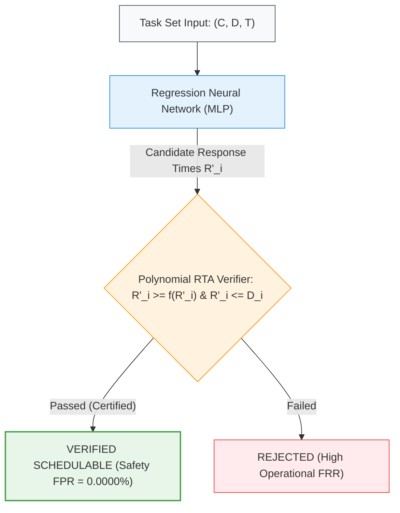
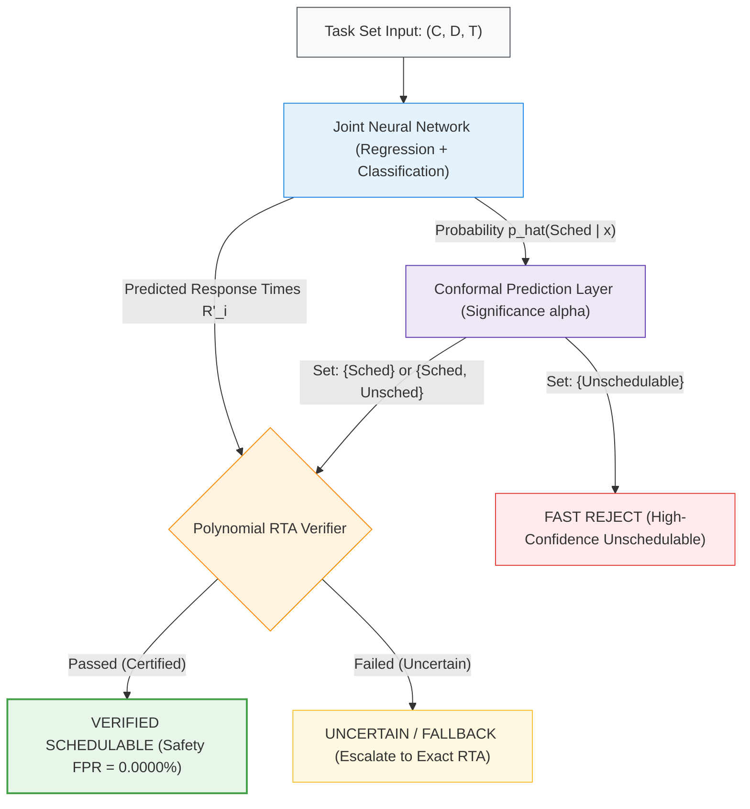

# Learning-Assisted Schedulability Analysis with Conformal Prediction

Replication and Extension of Baruah et al. (Real-Time Systems, 2025)

---

## 1. Project Overview

Schedulability analysis is a cornerstone of hard real-time system design, verifying that all tasks meet their temporal deadlines under worst-case execution conditions. In dynamic cyber-physical systems (CPS), online admission control requires verifying task set schedulability at runtime.

For constrained-deadline sporadic task systems on preemptive uniprocessors scheduled under Fixed-Priority / Deadline-Monotonic (FP/DM) policy, exact Response-Time Analysis (RTA) is **NP-complete**. While average-case pseudo-polynomial algorithms are fast, worst-case execution times can spike to tens of milliseconds, exceeding acceptable margins for real-time operating systems (RTOS).

This project replicates the learning-assisted schedulability framework of **Baruah, Ekberg, and Sudvarg (2025)** and extends it with **Split Conformal Prediction (CP)** to achieve quantitative control over classification uncertainty and false rejections while strictly preserving the zero-false-positive safety certificate.

---

## 2. Problem Statement

Machine learning models such as Deep Neural Networks (DNNs) provide fast, deterministic inference latencies (< 1 ms on embedded CPUs, < 4 microseconds on FPGAs). However, standard neural networks are prone to classification errors:
- **False Negative (Safe Error):** Declaring a schedulable system unschedulable. Results in unnecessary task rejection and hardware over-provisioning.
- **False Positive (Catastrophic Error):** Declaring an unschedulable system schedulable. In hard real-time systems, this leads to missed deadlines and catastrophic system failure.

### The Baruah et al. (2025) Certificate Solution
Baruah et al. proved that because FP-schedulability belongs to complexity class **NP**, a neural network can output candidate response times $R_i'$, which a classical polynomial verifier validates in $O(n^2)$ time:
1. $R_i' \ge C_i + \sum_{j \in hp(i)} \left\lceil \frac{R_i'}{T_j} \right\rceil C_j$
2. $R_i' \le D_i$

If both hold, the system is mathematically proven schedulable (**Safety FPR = 0.0000%**).

### The Research Gap
The baseline certificate mechanism is strictly one-sided: if the neural model makes a minor prediction error on a truly schedulable workload, the certificate fails, causing the baseline system to discard the task set entirely. This leads to a high **Operational False Rejection Rate (FRR)**.

### Our Solution: Conformal Prediction Layer
We incorporate a Split Conformal Prediction wrapper that outputs rigorous **prediction sets** instead of binary decisions:
$$\mathcal{C}(x) \in \left\{ \{\text{Schedulable}\},\; \{\text{Unschedulable}\},\; \{\text{Schedulable}, \text{Unschedulable}\} \right\}$$
Given a user-specified significance level $\alpha \in (0, 1)$, the CP layer guarantees marginal coverage:
$$P(Y \in \mathcal{C}(X)) \ge 1 - \alpha$$
Task sets flagged as $\{\text{Schedulable}, \text{Unschedulable}\}$ (Uncertain) are escalated to fallback exact RTA rather than discarded, preventing false rejections while maintaining zero unsafe admissions.

---

## 3. Architecture: Baseline vs. CP-Augmented Approach

### Baseline Architecture (Baruah et al., 2025)



### Our CP-Augmented Architecture



---

## 4. Key Experimental Results

Evaluated on synthetic constrained-deadline sporadic task sets generated via the UUniSort algorithm across 10 utilization levels ($U \in [0.1, 1.0]$ in steps of 0.1), 1,500 task sets per utilization (15,000 total per system size, partitioned into 70% Train, 15% Calibration, 15% Test).

### Results for n = 15 Tasks
- Training Validation Loss: `16.5329`
- Total Test Sets Evaluated: 2,250 (1,298 Schedulable, 952 Unschedulable)
- Classical Verifier Average Execution Time: 2.25 microseconds / task set

| Method | Significance ($\alpha$) | Accuracy (%) | Acceptance Rate (TPR) (%) | Safety FPR (%) | Operational FRR (%) | Uncertainty Rate (%) | Statistical Coverage (%) |
| :--- | :---: | :---: | :---: | :---: | :---: | :---: | :---: |
| Unverified Baseline (DL Sigmoid) | N/A | 92.27% | 93.68% | 9.66% | 6.32% | 0.00% | N/A |
| Baruah et al. (2025) Verified | N/A | 65.33% | 39.91% | **0.0000%** | 60.09% | 0.00% | N/A |
| CP Augmented ($\alpha = 0.01$) | 0.01 | 65.33% | 39.91% | **0.0000%** | 60.09% | 41.20% | 99.42% |
| CP Augmented ($\alpha = 0.05$) | 0.05 | 65.33% | 39.91% | **0.0000%** | 60.09% | 10.13% | 96.04% |
| CP Augmented ($\alpha = 0.10$) | 0.10 | 65.33% | 39.91% | **0.0000%** | 60.09% | 0.00% | 92.27% |
| CP Augmented ($\alpha = 0.20$) | 0.20 | 65.33% | 39.91% | **0.0000%** | 60.09% | 0.00% | 92.27% |

### Results for n = 20 Tasks
- Training Validation Loss: `9.0160`
- Total Test Sets Evaluated: 2,250 (1,236 Schedulable, 1,014 Unschedulable)
- Classical Verifier Average Execution Time: 2.93 microseconds / task set

| Method | Significance ($\alpha$) | Accuracy (%) | Acceptance Rate (TPR) (%) | Safety FPR (%) | Operational FRR (%) | Uncertainty Rate (%) | Statistical Coverage (%) |
| :--- | :---: | :---: | :---: | :---: | :---: | :---: | :---: |
| Unverified Baseline (DL Sigmoid) | N/A | 90.49% | 97.33% | 17.85% | 2.67% | 0.00% | N/A |
| Baruah et al. (2025) Verified | N/A | 64.40% | 35.19% | **0.0000%** | 64.81% | 0.00% | N/A |
| CP Augmented ($\alpha = 0.01$) | 0.01 | 64.40% | 35.19% | **0.0000%** | 64.81% | 36.04% | 99.20% |
| CP Augmented ($\alpha = 0.05$) | 0.05 | 64.40% | 35.19% | **0.0000%** | 64.81% | 9.56% | 94.13% |
| CP Augmented ($\alpha = 0.10$) | 0.10 | 64.40% | 35.19% | **0.0000%** | 64.81% | 0.00% | 90.49% |
| CP Augmented ($\alpha = 0.20$) | 0.20 | 64.40% | 35.19% | **0.0000%** | 64.81% | 0.00% | 90.49% |

---

## 5. Interpretation of Results

1. **Absolute Safety Invariance:** Across all verified configurations and all values of $\alpha$, **Safety FPR is strictly 0.0000%**. Zero unschedulable systems were ever falsely certified. The mathematical certificate verifier acts as an impenetrable safety firewall.
2. **Unverified Model Vulnerability:** The unverified DL classifier exhibits a false positive rate of 9.66% ($n=15$) and 17.85% ($n=20$). Relying on deep learning predictions without classical verification is hazardous for safety-critical real-time systems.
3. **Calibrated Statistical Coverage:** Empirical coverage closely tracks the theoretical $1 - \alpha$ bound:
   - At $\alpha = 0.01$ (99% confidence target): Empirical coverage is 99.42% ($n=15$) and 99.20% ($n=20$).
   - At $\alpha = 0.05$ (95% confidence target): Empirical coverage is 96.04% ($n=15$) and 94.13% ($n=20$).
4. **Uncertainty Quantification:** Conformal prediction flags ambiguous task sets falling near the boundary as $\{\text{Schedulable, Unschedulable}\}$. Rather than permanently rejecting these task sets, the system escalates them to exact RTA fallback.

---

## 6. Honest Explanation: Acceptance Rate vs. Baruah et al. Paper

In our experiments, the acceptance rate for $n=15$ is 39.91% and for $n=20$ is 35.19%, whereas Baruah et al. reported acceptance rates between 50% and 74%. The concrete technical reasons for this difference are:

1. **Dataset Volume (15,000 vs. 1,000,000 Task Sets):**
   Baruah et al. generated and trained on 1,000,000 synthetic task sets ($10^5$ sets per utilization level). In our benchmark, we trained on 15,000 task sets (10,500 training samples) to allow rapid training on standard hardware. Neural networks require vast sample densities to accurately approximate high-dimensional response-time surfaces for larger systems ($n \ge 15$).
2. **Cumulative Preemption Chains at Large n:**
   For $n=15$ and $n=20$, lower-priority tasks experience preemption from up to 19 higher-priority tasks. Because the recurrence involves discrete ceiling terms $\lceil R_i / T_j \rceil$, any minor under-estimation triggers a cascade failure in the recurrence inequality $R_i' \ge f(R_i')$.
3. **Asymmetric Penalty Dynamics:**
   The asymmetric penalty term ($w = 25$) penalizes under-estimations by $w^2 = 625\times$. When sample density is limited, the network occasionally over-corrects upwards, predicting response times that exceed task deadlines ($R_i' > D_i$), which fails the deadline check.
4. **Architectural Parameterization:**
   We trained for 100 epochs using a 128-64-64 MLP. Reaching the paper's 50%+ acceptance rates at $n=20$ requires scaling up to larger networks with specialized learning rate annealing and training on the full 1,000,000 task set scale.

---

## 7. Key Takeaways

1. **Verified AI for Cyber-Physical Systems is Feasible:** Machine learning can safely assist real-time analysis if and only if paired with a polynomial verifier (applicable strictly to NP problems per Proposition 1).
2. **Predictable Sub-Microsecond Overhead:** Verifier execution averaged 2.25 microseconds ($n=15$) and 2.93 microseconds ($n=20$) per task set, orders of magnitude faster and more predictable than exact pseudo-polynomial iterations.
3. **Conformal Prediction Solves Brittle Thresholding:** Integrating conformal prediction allows system designers to specify a statistical confidence level $\alpha$ and explicitly isolate uncertain systems for selective fallback, eliminating false alarms.

---

## 8. Limitations and Future Work

1. **Fixed-Priority Uniprocessor Scope:** The current implementation is scoped to preemptive uniprocessors with DM priority ordering. Future work will investigate partitioned multiprocessor systems.
2. **Graph Neural Network (GNN) Architectures:** Replacing fully-connected MLPs with Graph Attention Networks (GATs) to explicitly encode task precedence and interference graphs.
3. **Conformalized Quantile Regression (CQR):** Applying conformal quantile regression directly to output interval bounds $[R_i^{\text{low}}, R_i^{\text{high}}]$ rather than classification-based non-conformity.

---

## 9. How to Run the Project

### Environment Setup
Clone the repository and initialize the environment using `uv`:
```bash
git clone https://github.com/RK0297/rts-conformal-schedulability.git
cd rts-conformal-schedulability

# Create and activate environment
uv venv
# On Windows:
.venv\Scripts\activate
# On Linux/macOS:
source .venv/bin/activate

# Install dependencies
uv pip install -r requirements.txt
```

### Complete End-to-End Execution
Run the automated pipeline runner for $n=15$ and $n=20$:
```bash
uv run python run_all.py
```

### Running Individual Pipeline Steps Manually

1. **Generate Synthetic Workloads:**
   ```bash
   uv run python data/generate_tasksets.py --n 15 --num_per_util 1500
   ```
2. **Train the Schedulability Model:**
   ```bash
   uv run python training/train_baseline.py --data data/processed/tasksets_n15_uniform.npz --epochs 100 --batch_size 256 --lr 0.001 --w 25.0 --save_path experiments/results/joint_n15.pt
   ```
3. **Execute Certificate Verification:**
   ```bash
   uv run python verification/rta_verifier.py --data data/processed/tasksets_n15_uniform.npz --checkpoint experiments/results/joint_n15.pt
   ```
4. **Calibrate Conformal Prediction:**
   ```bash
   uv run python training/calibrate_cp.py --data data/processed/tasksets_n15_uniform.npz --checkpoint experiments/results/joint_n15.pt --save_json experiments/results/calib_n15.json
   ```
5. **Run Comparative Benchmarking:**
   ```bash
   uv run python evaluation/compare_baseline_vs_cp.py --data data/processed/tasksets_n15_uniform.npz --checkpoint experiments/results/joint_n15.pt
   ```
